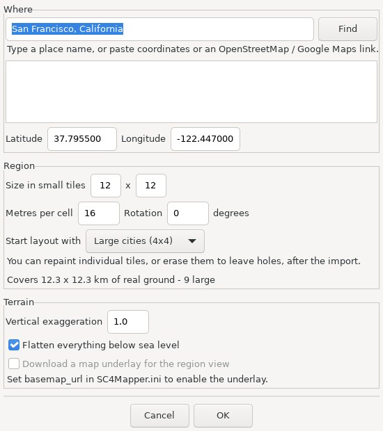
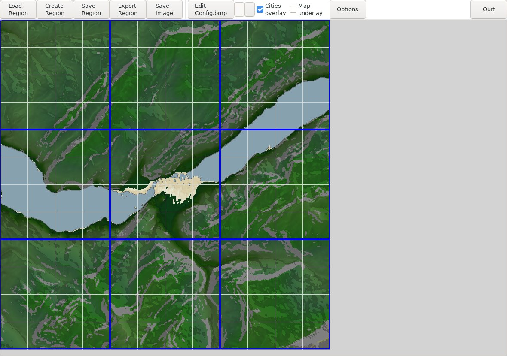
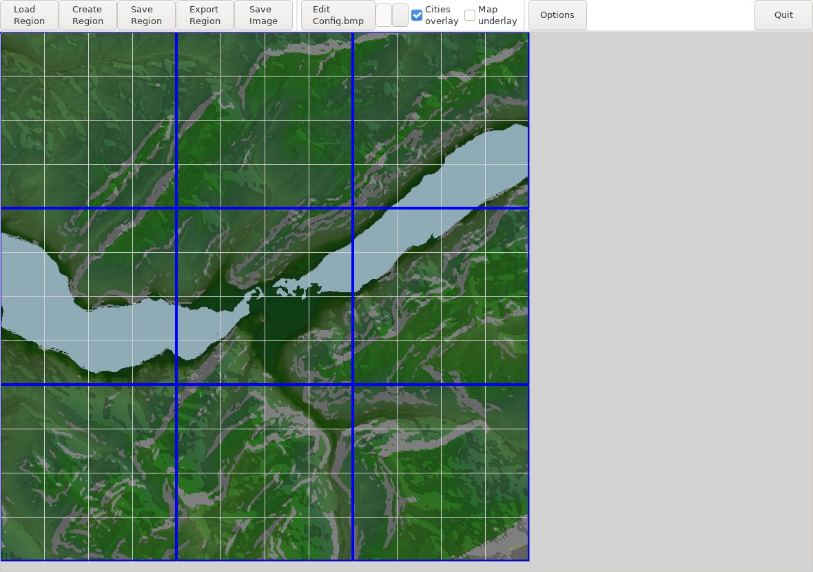
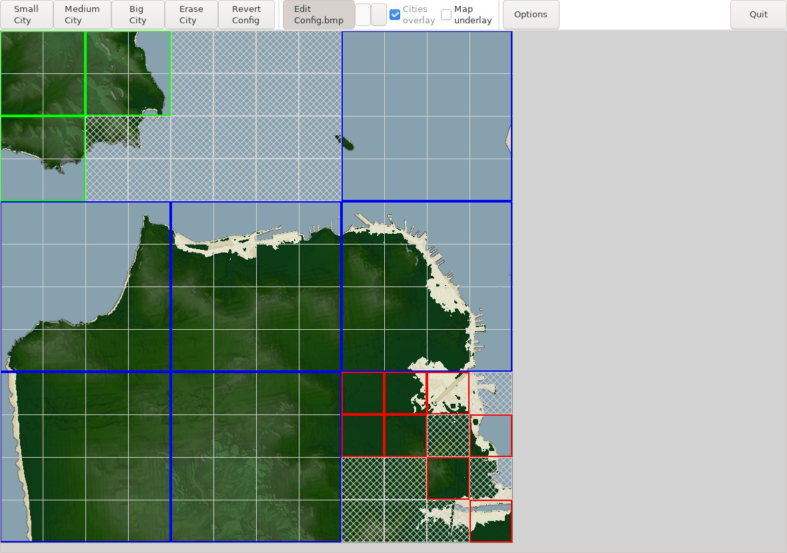

# SC4Mapper-2026

SC4Mapper is a SimCity 4 region import/export tool. This repository is a
modernization of the original [SC4Mapper-2013](https://github.com/wouanagaine/SC4Mapper-2013)
by Wouanagaine and JoeST, updated to run on current Python and wxPython with
less build and install friction.

> This modernization was carried out primarily using OpenAI Codex and
> Claude Code, supervised and verified by a human maintainer.

## What Changed

- Ported to Python 3 and wxPython 4.
- Replaced native extension modules with pure Python/NumPy:
  - `qfs.py` replaces the old `QFS` compression extension.
  - `terrain.py` replaces the old `tools3D` terrain rendering extension.
- Reorganized into a standard `src/sc4mapper/` package layout.
- Added a test suite covering QFS round-trips, city save fixtures, terrain
  rendering, and DBPF save round-trips.
- Replaced the old installer/batch packaging flow with a PyInstaller build.

## Real-World Locations

Besides importing a heightmap, SC4Mapper can build a region directly from
real-world elevation data. **Create Region -> Real-world location** asks for
a place and the shape of the region to cut out of it:



- **Where** takes a place name, a coordinate pair, or a pasted OpenStreetMap
  or Google Maps link. Place-name lookup uses OpenStreetMap's Nominatim
  service, one search per button press.
- **Metres per cell** is the scale. SimCity 4 cells are 16 m, so 16 is true
  scale; larger values squeeze more real ground into the same region. The
  dialog shows the resulting footprint in kilometres as you type.
- **Start layout with** picks the city size to pack the region with. Whatever
  does not fit is filled with smaller cities.
- **Refresh preview** downloads a low-resolution, north-up context view and
  draws the exact rotated footprint and city grid before the full import. It
  uses the configured basemap, or an elevation hillshade when none is set.
- **Heights** decides how elevations map onto SimCity 4's vertical axis
  (see below).
- Sea level is SimCity 4's 250 m datum. By default everything below the
  real shoreline is flattened to a shallow shelf, because scaled ocean
  bathymetry would otherwise bottom out as a pit.

Elevation comes from the [Mapzen/AWS terrain
tiles](https://registry.opendata.aws/terrain-tiles/): global coverage, open
data, no API key. Tiles are cached on disk, so re-importing an area is
offline and instant.

### Heights and the Vertical Axis

A SimCity 4 cell is always 16 m wide in game units, whatever slice of the
real world it stands for. Import at 48 m per cell and the ground is
squeezed to a third of its size horizontally while elevations are
untouched, so every slope comes out three times steeper than life. The
**Heights** setting handles that:

- **Match the horizontal scale** (default) multiplies heights by
  `16 / metres_per_cell`, so hills keep the profile they have in reality
  at any import scale.
- **Keep true elevations** leaves real metres alone. Correct at 16 m per
  cell; increasingly dramatic as you zoom out.
- **Exaggerate by** takes a factor of your own.

The import reports the slopes it produced, measured as the game sees them
-- rise over the fixed 16 m cell. Roughly, grades past about 15% start to
give SimCity 4's networks trouble, so a region reporting a large fraction
above that will need terraforming before much can be built. Some places
are simply like that: an 8 km square of the Grand Canyon at true scale
comes out with 71% of its edges over 15%, which is the canyon being a
canyon rather than anything the importer did wrong.

Two other things the importer does automatically:

- **Ocean depth is capped.** Scaled bathymetry reaches several kilometres
  down and would otherwise bottom out as a vast pit, so everything below
  the shoreline is flattened to a shallow shelf. Untick *Flood everything
  below the shoreline* to keep the real sea floor.
- **Artifacts are removed.** Global DEM mosaics carry occasional junk
  pixels; the tile covering the sea off Hong Kong, for instance, holds a
  handful of 5000-6000 m readings. Samples that sit more than 200 m from
  their local median are replaced, which takes out the needles while
  leaving cliffs and ridge lines alone. The import reports how many it
  found.

### The Shoreline

SimCity 4's water sits at a fixed 250 m, so the importer instead chooses
**which real elevation becomes that shoreline**. Getting it wrong is not
subtle:

- **Real sea level** is right on the coast. An 8 km square of San Francisco
  imports 35% under water, which is the Pacific and the Bay.
- Inland it fails badly. Interlaken's valley floor is at 553 m, so real sea
  level leaves the whole region 300 m above the shoreline with no water at
  all — Lake Thun and Lake Brienz import as dry land. Setting the shoreline
  to 565 m puts both lakes back in the water with the town on the isthmus
  between them.



- It also fails below sea level. Dutch polders sit around −5 m but are dry
  land; at real sea level, 15% of an Amsterdam import floods, taking
  Schiphol with it. **Lowest ground in the area** drops the shoreline under
  everything so the region imports dry.

So the setting has three modes: *Real sea level*, *Lowest ground in the
area*, and an explicit elevation. The import reports how much of the region
ended up under water, which is the quickest way to tell you picked wrong.

A single shoreline elevation cannot separate water from low land, though:
two lakes at different heights need a compromise value, and in the
Netherlands the canals would import as land along with the polders. That is
what the water mask below is for.

### Water From OpenStreetMap

Under **Water from OpenStreetMap**, lakes and rivers can be looked up
directly rather than inferred from elevation. Two rules are applied, and
both matter:

- Mapped water is pushed below the waterline.
- Everything else is *raised above* it, however low it really sits.

The second rule is what makes a polder work. Together they cut the wet/dry
question loose from elevation entirely, which a shoreline datum can never
do. Interlaken imports with both lakes at their real outlines and the
valley between them dry, without tuning a datum at all; Amsterdam imports
with its waterways wet and its polders dry.

Three settings:

- **From elevation only** -- no lookup, the behaviour above.
- **Add mapped water** -- mapped water on top of whatever the shoreline
  already floods. Right for the coast, where the sea comes from elevation.
- **Mapped water only** -- the map is the whole truth. Use where elevation
  lies about water, which is anywhere built on land below sea level.

Two filters guard against nonsense, both adjustable:

- **Ignore smaller than N cells** drops creeks and ponds too small to read.
- **...or more than N m above the shoreline** is the important one. SimCity
  4 has exactly one water level, so a body only makes sense as water if it
  already sits near it. Flooding a stream several hundred metres up gouges a
  canyon straight down the mountain -- in testing, an alpine creek carved a
  579 m trench before this filter existed. Bodies too high are left as
  terrain, because they simply are not representable.



Queries go to Overpass, which is volunteer-run: one request per import,
cached on disk afterwards, so re-importing an area is free and offline.
Tag filters are written unquoted, because overpass-api.de currently
answers 406 Not Acceptable to some requests carrying quoted values, and
the request falls through to a mirror if the first endpoint refuses it.
Coastlines are deliberately not fetched -- OSM tags them as open ways with
land on the left rather than closed polygons, and the sea is the one case
elevation already handles well.

### Laying Out City Tiles

The import produces a starting layout you then reshape with **Edit
Config.bmp** -- paint small, medium or large cities over the imported
terrain, or erase tiles to leave holes:



Blue outlines are large cities, green medium, red small; hatched tiles are
holes. Enabling `basemap_url` (see below) draws a real map underneath the
terrain so you can see what you are turning into city tiles.

### Map Underlay

`config/SC4Mapper.ini` has a `[geo]` section:

```ini
[geo]
elevation_url = https://s3.amazonaws.com/elevation-tiles-prod/terrarium/{z}/{x}/{y}.png
elevation_attribution = Elevation: Mapzen Terrain Tiles / AWS Open Data
basemap_url =
basemap_attribution =
overpass_urls =
    https://overpass-api.de/api/interpreter
    https://overpass.kumi.systems/api/interpreter
basemap_opacity = 0.55
```

`basemap_url` is empty by default and the underlay is switched off. Unlike
the elevation source, general map and imagery providers each set their own
terms -- OpenStreetMap's tile policy, for instance, forbids distributed
applications from drawing on their servers -- so choosing a provider, and
supplying any API key it needs, is left to you. Any XYZ tile URL works;
note that some providers order the path `{z}/{y}/{x}`. Templates may also
use `{s}` for a rotating tile-server subdomain and `{l}` for a layer code
(`m` by default). For Google-style `{s}.google.com` templates, `{s}` expands
to `mt0` through `mt3`; use a literal layer value such as `lyrs=s` when a
layer other than the default map is wanted.

These provider URLs and their attribution text can also be changed from
**File -> Options**. Overpass endpoints are entered one per line and are
tried in order. Tile caches are kept separate by provider, so changing a URL
cannot mix old tiles into a new source.

### Georeference Record

Every city saved from a real-world import carries a small record saying
where on Earth it came from, stored inside the `.sc4` under its own TGI
(`0x9A6D5C21` / `0x53434752` / `1`). SimCity 4 ignores entries it does not
recognise, so it simply rides along with the save -- share the region and
the georeferencing goes with it, with no sidecar file to lose.

The payload is UTF-8 JSON, a few hundred bytes:

```json
{
 "format": "sc4mapper.georef",
 "version": 1,
 "frame": {
  "center_lat": 37.7955, "center_lon": -122.447,
  "grid_width": 257, "grid_height": 257,
  "metres_per_cell": 16.0, "rotation_deg": 0.0
 },
 "tile": { "offset_x": 0, "offset_z": 0, "size": 4, "cells": 256 },
 "projection": {
  "model": "local_equirectangular_wgs84_series_v1",
  "crs": "EPSG:4326",
  "metres_per_degree_lat_coeffs": [111132.92, -559.82, 1.175, -0.0023],
  "metres_per_degree_lon_coeffs": [111412.84, -93.5, 0.118]
 },
 "heights": {
  "sea_level_m": 250.0, "vertical_scale": 1.0, "sea_reference_m": 0.0,
  "ocean_depth_m": 20.0, "keep_bathymetry": false
 },
 "source": { "elevation": "...terrarium/{z}/{x}/{y}.png", "zoom": 13 },
 "region": "San Francisco",
 "import_id": "b09e4cef2d014aa7a8602010c51cb158"
}
```

`frame` is the local metric grid the whole region was sampled on; `tile`
says where this particular city sits inside it, in cells from the grid's
north-west corner. `projection` publishes the earth model *and its
coefficients*, so a reader in another language reproduces the mapping
exactly instead of guessing at a sphere and drifting a few cells across a
large region.

Both directions are covered, and both have reference implementations the
tests check against the grid the importer actually sampled:

- `geo.georef_cell_to_lonlat(record, cell_x, cell_z)` -- for labelling
  terrain.
- `geo.georef_lonlat_to_cell(record, lon, lat)` -- the direction a plugin
  needs. Given an OpenStreetMap node, where does it go? Returns fractional
  cells local to the tile; values outside `0 .. tile.cells` mean the point
  belongs to a different city.

Heights invert too, above the shoreline: `real = sea_reference_m +
(in_game - sea_level_m) / vertical_scale`. Below it the ground was
flattened to a shelf, so `ocean_depth_m` and `keep_bathymetry` are recorded
to say which cells not to trust.

`import_id` changes on every import, so a reader can cache derived data
against it and know when a region has been re-imported underneath it.

It is JSON rather than a binary format on purpose: it is small enough that
compactness buys nothing, it can be read from any language without
tooling, and anyone poking at a save in a hex editor can see what it says.

One caveat if you are writing a reader: SimCity 4 rebuilds the archive when
it saves a city, and nothing registers a handler for this entry, so it may
well be dropped the first time a player saves in game. A plugin that wants
the record to survive should read it on load and write it back on save.

## Running From Source

Install [uv](https://docs.astral.sh/uv/), then:

```sh
uv sync
uv run sc4mapper
```

The editable settings file is `config/SC4Mapper.ini`. It contains the default
import/export/save folders and the terrain colour palette. Paths may use
`{documents}`, `{home}`, and `{config}` placeholders.

## Tests

```sh
uv sync --group dev
uv run pytest
```

## Building

```sh
uv sync --group build
uv run pyinstaller --clean --noconfirm SC4Mapper.spec
```

**Windows** — copy the config folder alongside the executable, then zip:

```powershell
Copy-Item -Recurse -Force config dist/SC4Mapper/config
Compress-Archive -Path dist/SC4Mapper -DestinationPath SC4Mapper-windows.zip
```

**macOS** — copy config into the app bundle, then archive:

```sh
cp -R config dist/SC4Mapper.app/Contents/MacOS/config
ditto -c -k --sequesterRsrc --keepParent dist/SC4Mapper.app SC4Mapper-macos.zip
```

**Linux** — copy config alongside the executable, then archive:

```sh
cp -R config dist/SC4Mapper/config
tar -czf SC4Mapper-linux.tar.gz -C dist SC4Mapper
```

## Releases

Pushing a tag matching `vYYYY.Nsuffix` (for example `v2026.1a`) triggers a
GitHub Actions release build. Windows is the required artifact. macOS and Linux
builds are experimental and attached when they succeed.

### macOS

The app bundle is ad-hoc signed but does not carry an Apple Developer
certificate. Remove the quarantine flag once after unzipping:

```sh
xattr -rd com.apple.quarantine SC4Mapper.app
```

## Repository Layout

- `src/sc4mapper/` — application source
- `src/sc4mapper/assets/` — bundled city templates and splash image
- `config/SC4Mapper.ini` — user-editable defaults and terrain palette
- `scripts/run_sc4mapper.py` — PyInstaller entry point
- `tests/` — regression tests

## License

See `license.txt`.
